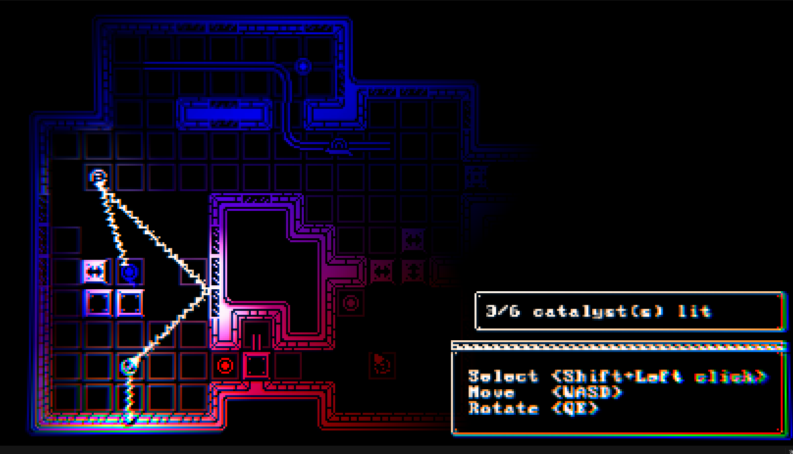
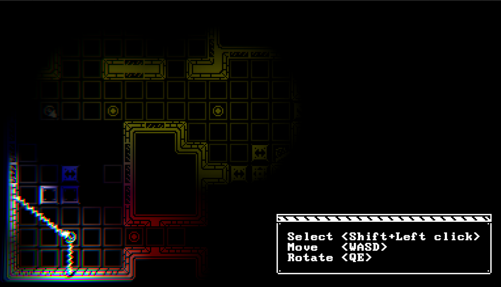
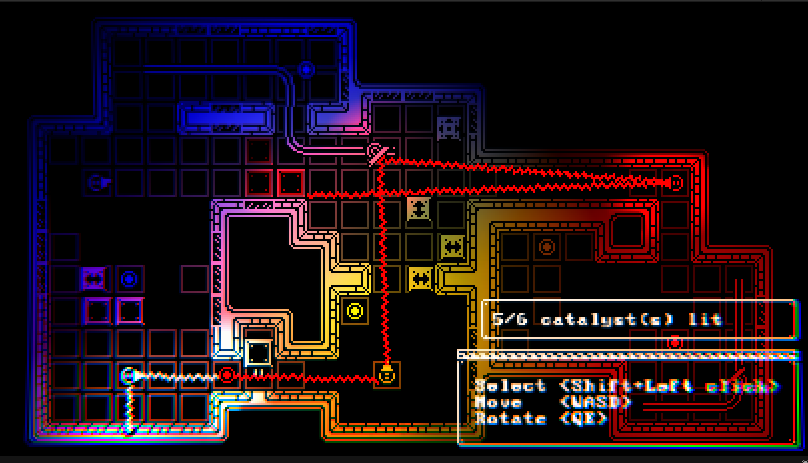

# Lumens

 A puzzle game made within a 28 weeks time limit _(18/28)_ as a side project.
 Currently does not have any levels.
 
 > Darkness has fallen in the underworld. Reactivate the ancient catalysts and bring back the light. Beware, for they will bend your light to higher planes!\
 > Watch your rays' colour out; their components (RYB) point which higher plane they are intersecting!
 
 
 
 
 
 # TODO LIST (ordered)
- [x] Implement laser reflection
- [x] Implement hyperplane interactions & catalysts
- [x] Implement buttons, self-moving obstacles and mirrors
- [ ] Make a playground level
- [ ] Add sound effects
- [ ] Make several levels
- [ ] Add a tutorial
- [ ] Implement sound distorsion depending on the 3 RYB bits
- [ ] Add music
