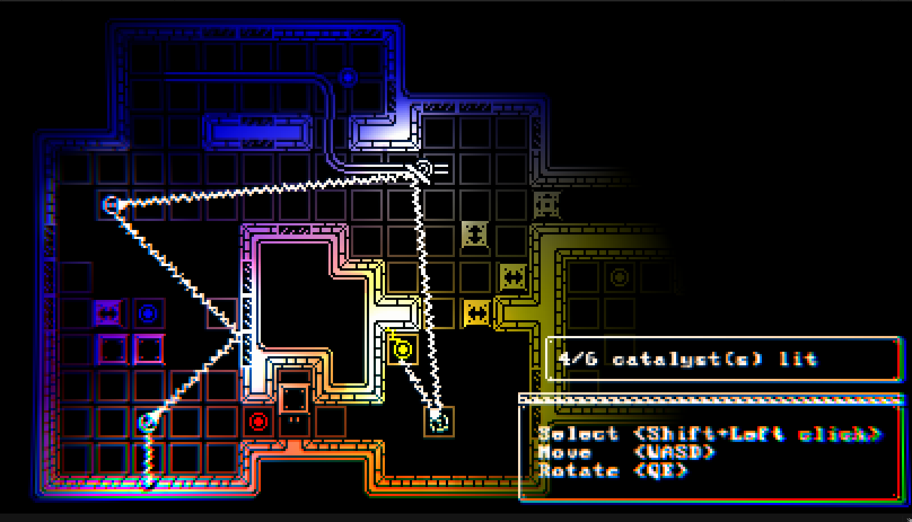

# Lumens

 

## Description

 A puzzle game made within a 28 weeks time limit as a side project *(DEADLINE reached on the 17/04/23)*.
 
 [Download the prototype build!](../main/Lumens/)
 
 > Darkness has fallen upon the underworld. Reactivate the ancient catalysts and bring back the light before you run out of power. Beware, for they will bend your light to higher planes!\
 > Watch your rays' colour out; their components (RYB) point which higher plane they are intersecting!
 
 
 
 
 
 
 
 ## Summary
 
  I hadn't used **Unity** for game dev for a long time so I was a bit rusted. As usual I spent too much time refactoring and cleaning the game without actually making proper levels. **Unity DOTS** still seems to be not production ready so I had to make a workaround for **ECS** *(without implementing parallelisation)*. It was also the first time actually using a music for one of my game.
 
